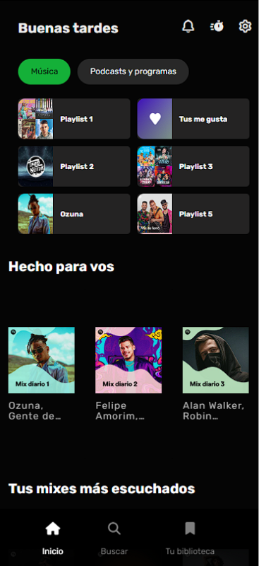
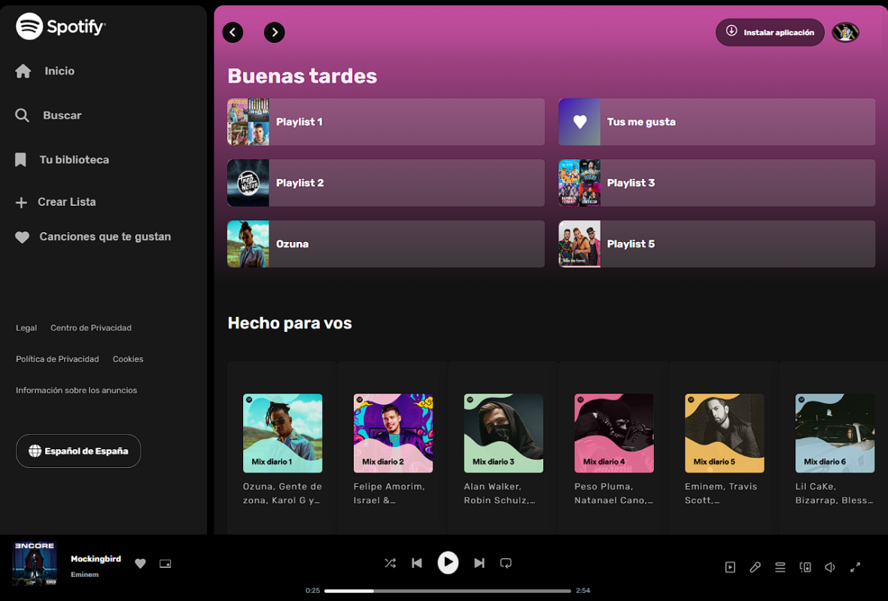

# Clon de Spotify

Este proyecto es un clon de la interfaz de usuario de Spotify, desarrollado con ```HTML, CSS y JavaScript```. El objetivo es recrear la experiencia visual y de navegación de la plataforma de música popular.

## Capturas de Pantalla

### Mobile



### PC 


